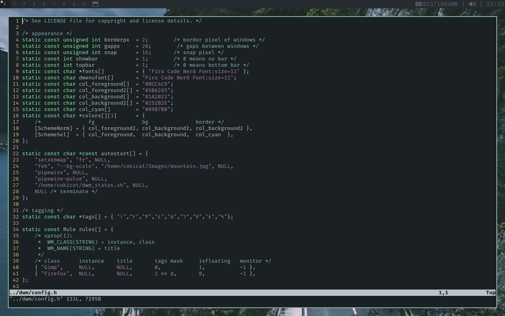
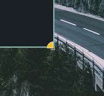

<h1 align="center">cokicat's dotfiles — suckless</h1>
<p align="center"><b>Colorscheme: <a href="https://github.com/myagko/nymph.git">nymph</a> by <a href="https://github.com/myagko/">myagko</a></b><p>
<p align="center"><b><a href="https://w.wallhaven.cc/full/x1/wallhaven-x1vk3z.jpg">Wallpaper</a></b><p>
<br>

Here are my dotfiles for st and dwm (very lightweight).  
My other dotfiles (like bash and vim dotfiles) are located at [cokicat/dotfiles](https://github.com/cokicat/dotfiles.git).

- **GTK Theme**: [Colloid-Dark-Everforest](https://github.com/vinceliuice/Colloid-gtk-theme)
- **Icon Theme**: [Papirus-Dark](https://github.com/PapirusDevelopmentTeam/papirus-icon-theme) (paleorange)
- **Font**: [Fira Code Nerd Font](https://github.com/ryanoasis/nerd-fonts/releases/download/v3.2.1/FiraMono.zip)
- **Cursor Theme**: [Bibata-Modern-Classic](https://github.com/ful1e5/Bibata_Cursor)
- **Launcher**: dmenu

## Install
- [ ] todo

## dwm
dwm version: 6.8
### License
See `dwm/LICENSE` for more informations.
### Status Command
Status command is generated by dwm_status.sh.
### Mods
**Gaps and borders are showed when only one client with uselessgaps:**

```c
//line 1327 in dmw.c

	/* Get number of clients for the client's monitor */
	for (n = 0, nbc = nexttiled(c->mon->clients); nbc; nbc = nexttiled(nbc->next), n++);

	/* Do nothing if layout is floating */
	if (c->isfloating || c->mon->lt[c->mon->sellt]->arrange == NULL) {
		gapincr = gapoffset = 0;
	} else {
		/* Modified by cokicat */
		
		/* Remove border and gap if layout is monocle or only one client */
		//if (c->mon->lt[c->mon->sellt]->arrange == monocle || n == 1) {
		/* Don't remove border and gap if only one client */
		if (c->mon->lt[c->mon->sellt]->arrange == monocle) {
			gapoffset = 0;
			gapincr = -2 * borderpx;
			wc.border_width = 0;
		} else {
			gapoffset = gappx;
			gapincr = 2 * gappx;
		}
	}
```  
**Cursor when resizing a window is fixed (default is unsupported by Bibata-Modern-Classic):**  

```c
// line 1675 in dwm.c
	cursor[CurResize] = drw_cur_create(drw, XC_bottom_right_corner);
```
### Patches used
Patches are in `dwm/patches`.
- actualfullscreen
- cfacts
- cool-autostart
- movestack
- notitle
- uselessgap

## st
st version: 0.9.2
### License
See `st/LICENSE` for more informations.
### Patches used
Patches are in `dwm/patches`.
- blinking_cursor
